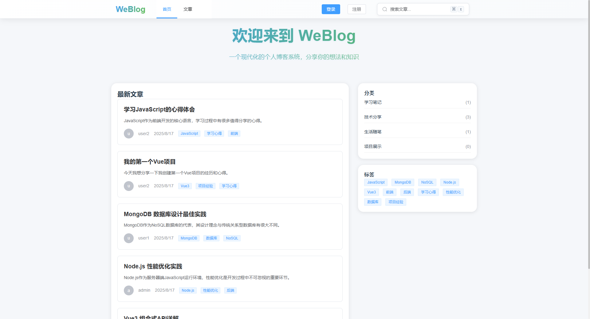
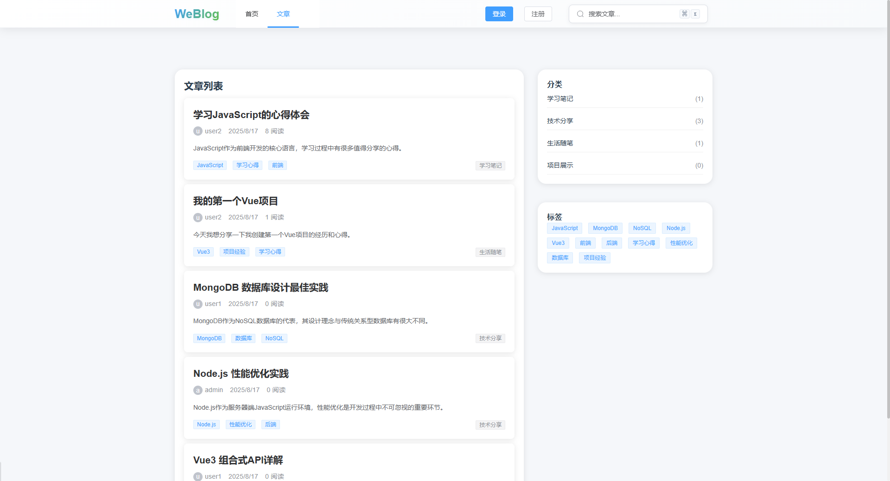
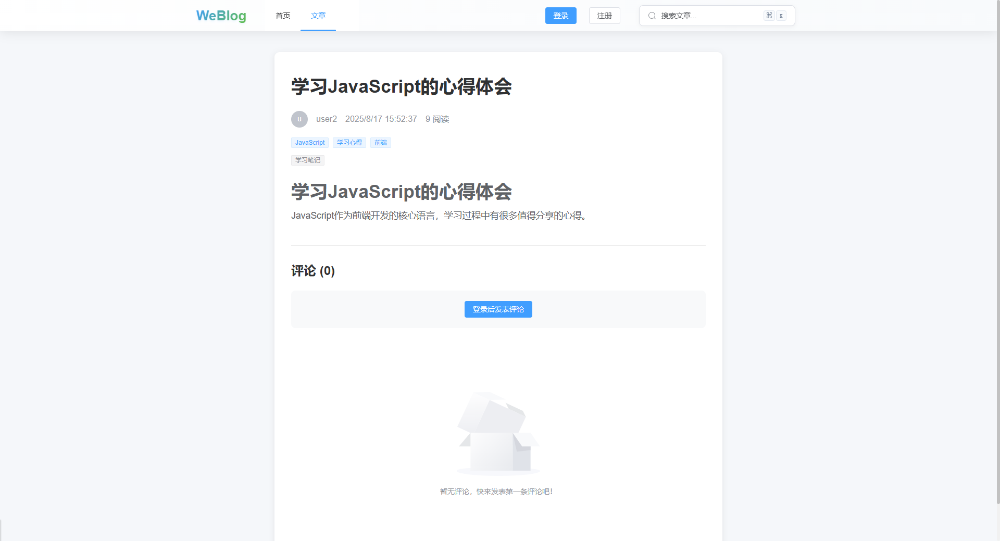
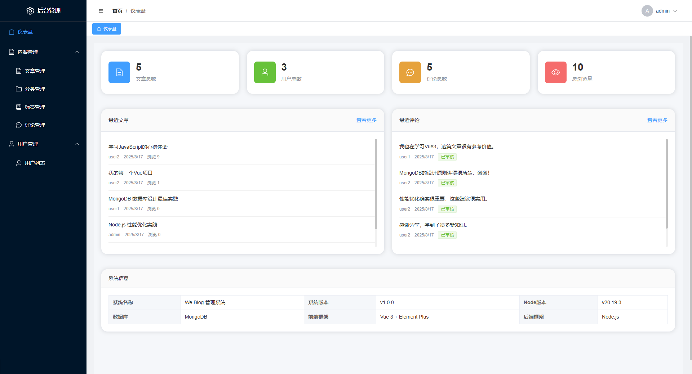
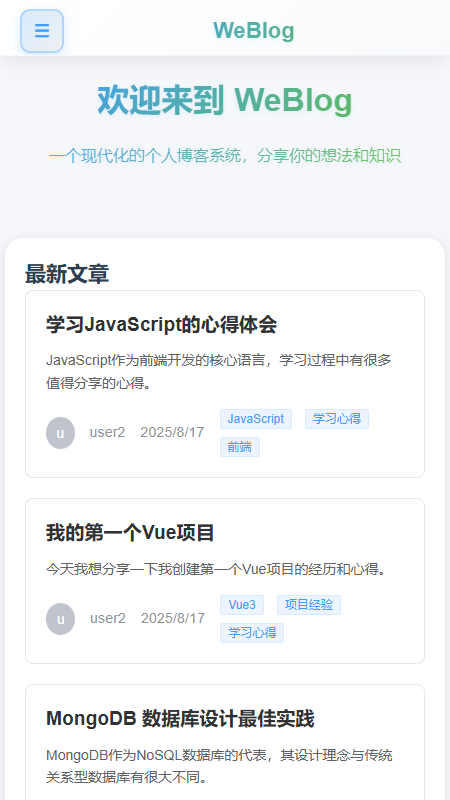
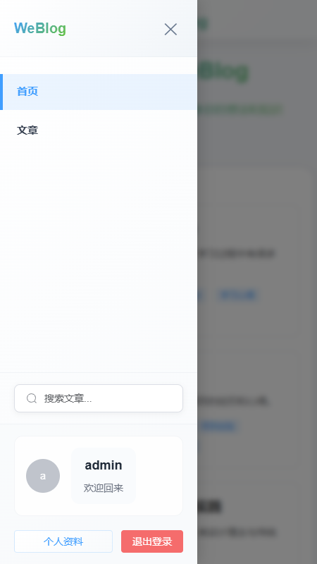
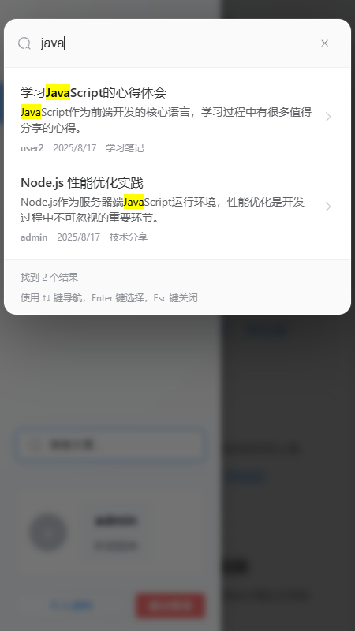
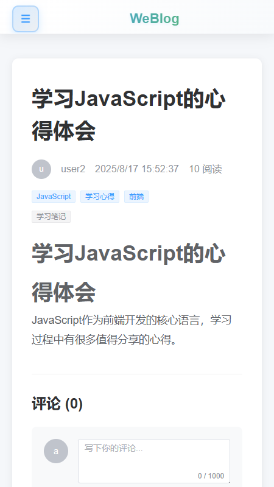

# WeBlog - Vue3 + Node.js + MongoDB 个人博客系统

[](https://vuejs.org/)
[](https://nodejs.org/)
[](https://www.mongodb.com/)
[](LICENSE)

一个基于 Vue3 + Node.js + MongoDB 构建的现代化个人博客系统，支持文章管理、用户管理、评论系统、分类标签等完整功能。

## ✨ 功能特性

### 🎯 核心功能
- **文章管理**: 支持 Markdown 编辑、富文本预览、文章分类标签
- **用户系统**: 用户注册登录、权限管理、个人资料
- **评论系统**: 文章评论、评论管理、用户互动
- **分类标签**: 文章分类、标签管理、内容组织
- **搜索功能**: 全站搜索、实时搜索建议
- **响应式设计**: 支持桌面端和移动端，完美适配各种设备

### 🛠️ 管理功能
- **仪表盘**: 数据统计、访问分析、系统概览
- **内容管理**: 文章创建编辑、草稿保存、状态管理
- **用户管理**: 用户权限、角色分配、账户管理
- **系统管理**: 分类标签、评论审核、文件上传

### 🎨 界面特性
- **现代化UI**: 基于 Element Plus 的美观界面
- **主题定制**: 支持自定义主题色彩
- **动画效果**: 流畅的页面过渡和交互动画
- **移动优先**: 响应式设计，移动端体验优秀

## 📸 项目截图

### 🖥️ 桌面端界面
| 功能 | 截图 | 说明 |
|------|------|------|
| **首页** |  | 响应式首页设计，展示最新文章和分类 |
| **文章列表** |  | 文章列表页面，支持分页和筛选 |
| **文章详情** |  | 文章阅读页面，支持评论和分享 |
| **管理后台** |  | 完整的后台管理系统 |

### 📱 移动端界面
| 功能 | 截图 | 说明 |
|------|------|------|
| **移动首页** |  | 移动端优化的首页布局 |
| **侧边栏导航** |  | 移动端侧边栏导航菜单 |
| **搜索功能** |  | 全屏搜索模态框 |
| **文章阅读** |  | 移动端文章阅读体验 |

## 🚀 技术栈

### 前端 (Frontend)
- **Vue 3.3.8+** - 渐进式 JavaScript 框架
- **Vue Router 4.2.5+** - 官方路由管理器
- **Pinia 2.1.7+** - Vue 状态管理库
- **Element Plus 2.4.4+** - Vue 3 组件库
- **Vite 5.0.0+** - 下一代前端构建工具
- **Sass** - CSS 预处理器
- **Axios** - HTTP 客户端
- **Marked** - Markdown 解析器
- **Highlight.js** - 代码高亮

### 后端 (Backend)
- **Node.js 18+** - JavaScript 运行时
- **Express 4.18.2+** - Web 应用框架
- **MongoDB 5.0+** - NoSQL 数据库
- **Mongoose 8.0.3+** - MongoDB 对象建模工具
- **JWT** - JSON Web Token 认证
- **bcryptjs** - 密码加密
- **Multer** - 文件上传中间件
- **Helmet** - 安全中间件
- **Morgan** - HTTP 请求日志

## 📁 项目结构

```
vue-blog/
├── frontend/                 # 前端项目
│   ├── src/
│   │   ├── components/      # 公共组件
│   │   ├── views/           # 页面组件
│   │   │   ├── admin/       # 管理后台页面
│   │   │   └── ...          # 前台页面
│   │   ├── layouts/         # 布局组件
│   │   ├── stores/          # Pinia 状态管理
│   │   ├── hooks/           # 组合式函数
│   │   ├── router/          # 路由配置
│   │   └── utils/           # 工具函数
│   ├── public/              # 静态资源
│   └── package.json
├── backend/                  # 后端项目
│   ├── routes/              # API 路由
│   ├── models/              # 数据模型
│   ├── middleware/          # 中间件
│   ├── scripts/             # 脚本文件
│   ├── uploads/             # 上传文件目录
│   └── server.js            # 服务器入口
├── package.json             # 根项目配置
└── README.md
```

## 🚀 快速开始

### 环境要求
- Node.js 18.0.0 或更高版本
- MongoDB 5.0 或更高版本
- npm 或 yarn 包管理器

### 安装步骤

1. **克隆项目**
   ```bash
   git clone <repository-url>
   cd vue-blog
   ```

2. **安装依赖**
   ```bash
   # 安装所有依赖（前端 + 后端）
   npm run install:all
   
   # 或者分别安装
   npm install
   cd frontend && npm install
   cd ../backend && npm install
   ```

3. **环境配置**
   ```bash
   # 复制环境变量文件
   cp backend/env.example backend/.env
   
   # 编辑 .env 文件，配置数据库连接等信息
   MONGODB_URI=mongodb://localhost:27017/vue-blog
   JWT_SECRET=your-jwt-secret
   PORT=3000
   ```

4. **启动开发服务器**
   ```bash
   # 同时启动前端和后端
   npm run dev
   
   # 或者分别启动
   npm run dev:frontend    # 前端 (默认端口 5173)
   npm run dev:backend     # 后端 (默认端口 3000)
   ```

5. **访问应用**
   - 前端: http://localhost:5173
   - 后端: http://localhost:3000
   - 管理后台: http://localhost:5173/admin

### 生产部署

1. **构建前端**
   ```bash
   npm run build
   ```

2. **启动生产服务器**
   ```bash
   npm start
   ```

## 📚 API 文档

### 认证相关
- `POST /api/auth/register` - 用户注册
- `POST /api/auth/login` - 用户登录
- `GET /api/auth/profile` - 获取用户信息
- `PUT /api/auth/profile` - 更新用户信息

### 文章相关
- `GET /api/posts` - 获取文章列表
- `GET /api/posts/:id` - 获取文章详情
- `POST /api/posts` - 创建文章
- `PUT /api/posts/:id` - 更新文章
- `DELETE /api/posts/:id` - 删除文章
- `GET /api/posts/search` - 搜索文章

### 评论相关
- `GET /api/posts/:id/comments` - 获取文章评论
- `POST /api/posts/:id/comments` - 添加评论
- `PUT /api/comments/:id` - 更新评论
- `DELETE /api/comments/:id` - 删除评论

### 分类标签
- `GET /api/categories` - 获取分类列表
- `POST /api/categories` - 创建分类
- `PUT /api/categories/:id` - 更新分类
- `DELETE /api/categories/:id` - 删除分类
- `GET /api/tags` - 获取标签列表
- `POST /api/tags` - 创建标签
- `PUT /api/tags/:id` - 更新标签
- `DELETE /api/tags/:id` - 删除标签

### 用户管理
- `GET /api/users` - 获取用户列表
- `GET /api/users/:id` - 获取用户详情
- `PUT /api/users/:id` - 更新用户信息
- `DELETE /api/users/:id` - 删除用户

### 文件上传
- `POST /api/upload/image` - 上传图片
- `POST /api/upload/file` - 上传文件

### 统计信息
- `GET /api/admin/stats` - 获取统计数据
- `GET /api/admin/stats/realtime` - 获取实时统计

## 🔧 开发指南

### 前端开发
```bash
cd frontend
npm run dev          # 启动开发服务器
npm run build        # 构建生产版本
npm run preview      # 预览构建结果
```

### 后端开发
```bash
cd backend
npm run dev          # 启动开发服务器（支持热重载）
npm start            # 启动生产服务器
npm run init-data    # 初始化测试数据
```

### 代码规范
- 使用 ESLint 进行代码检查
- 遵循 Vue 3 组合式 API 最佳实践
- 使用 TypeScript 类型注解（可选）

## 🧪 测试

```bash
# 运行测试
npm test

# 初始化测试数据
cd backend
npm run init-data
```

## 📦 部署

### Docker 部署
```dockerfile
# 构建镜像
docker build -t vue-blog .

# 运行容器
docker run -p 3000:3000 -p 5173:5173 vue-blog
```

### 传统部署
1. 构建前端项目
2. 配置 Nginx 反向代理
3. 使用 PM2 管理 Node.js 进程
4. 配置 MongoDB 数据库

## 🤝 贡献指南

1. Fork 项目
2. 创建功能分支 (`git checkout -b feature/AmazingFeature`)
3. 提交更改 (`git commit -m 'Add some AmazingFeature'`)
4. 推送到分支 (`git push origin feature/AmazingFeature`)
5. 打开 Pull Request

## 📄 许可证

本项目采用 MIT 许可证 - 查看 [LICENSE](LICENSE) 文件了解详情。

## 🙏 致谢

- [Vue.js](https://vuejs.org/) - 渐进式 JavaScript 框架
- [Element Plus](https://element-plus.org/) - Vue 3 组件库
- [Express](https://expressjs.com/) - Node.js Web 应用框架
- [MongoDB](https://www.mongodb.com/) - NoSQL 数据库

## 📞 联系方式

- 项目主页: [GitHub Repository]
- 问题反馈: [Issues]
- 功能建议: [Discussions]

---

⭐ 如果这个项目对你有帮助，请给它一个星标！
